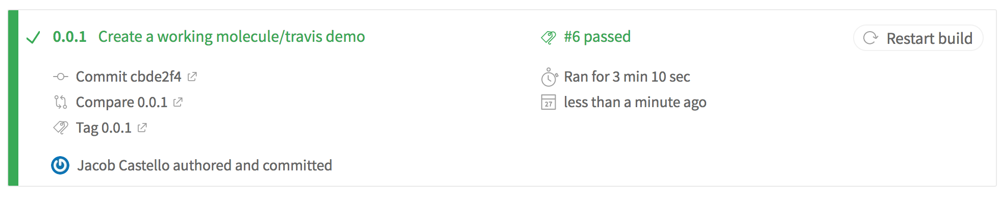

# Test Your Ansible

A tale about making Molecule work for you.


## What is Ansible?

- IT automation
- Yaml
- RedHat Supported
- Bash for lazy developers


Note:
- python-based


## What Ansible is _not_


### A programming language


### Install a Package

```ansible
- name: Update dnsmasq
  package:
    name: dnsmasq
    state: present
```


## So how do you test it?


### Acceptance testing

A test conducted to determine if the requirements of a specification or contract are met.

Note:

- According to wikipedia


## Molecule

A testing framework for Ansible


## Steps
- destroy
- dependency
- syntax
- create
- prepare
- converge
- idempotence
- lint
- side_effect
- verify
- destroy


## Drivers
- Docker
- VirtualBox
- AWS
- OpenStack


## Verifiers
- Testinfra
- Goss

Note:
- Testinfra is a lot like serverspec
- Goss is written in Go, looks tasty


## Testinfra

```python
def test_dnsmasq_package(host):
    dnsmasq_package = host.package('dnsmasq')

    assert dnsmasq_package.is_installed
    assert dnsmasq_package.version.startswith("2.76")
```


## Virtualenv

It works! Use it!


### I thought this was easy

`molecule test`


### I wrote
```ansible
- name: Update dnsmasq
  package:
    name: dnsmasq
    state: present
```


### I tested
```python
def test_dnsmasq_package(host):
    dnsmasq_package = host.package('dnsmasq')

    assert dnsmasq_package.is_installed
    assert dnsmasq_package.version.startswith("2.76")
```


### I ran

```bash
source $(pipenv --venv)/bin/activate && molecule test
```


### I got



## Why I like it

* Repeatable
* Portable
* Verifiable
* Works with CI
* If your role uses it, I'm more likely to use your role


# Contact info
* Jacob Castello
* jacob.castello@excella.com
* github.com/champain
